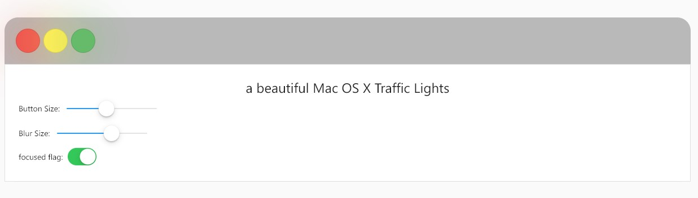

# macwindowctl

mac Traffic Lights, a beautiful



live demo: https://codepen.io/atdrago/pen/yezrBR

add you `pubspec.yaml`

```yaml
dependencies:

  macwindowctl:
    git:
      url: git://github.com/d1y/macwindowctl
      ref: master
```

```dart
Macwindowctl(
  buttonSize: 24,
  blurSize: 24,
  focused: true,
  onHover: (action) {
    // print("hover action: $action");
  },
  onExit: (action) {
    // print("exit action: $action");
  },
  onClick: (action) {
    print("click handle: $action");
  },
),
```